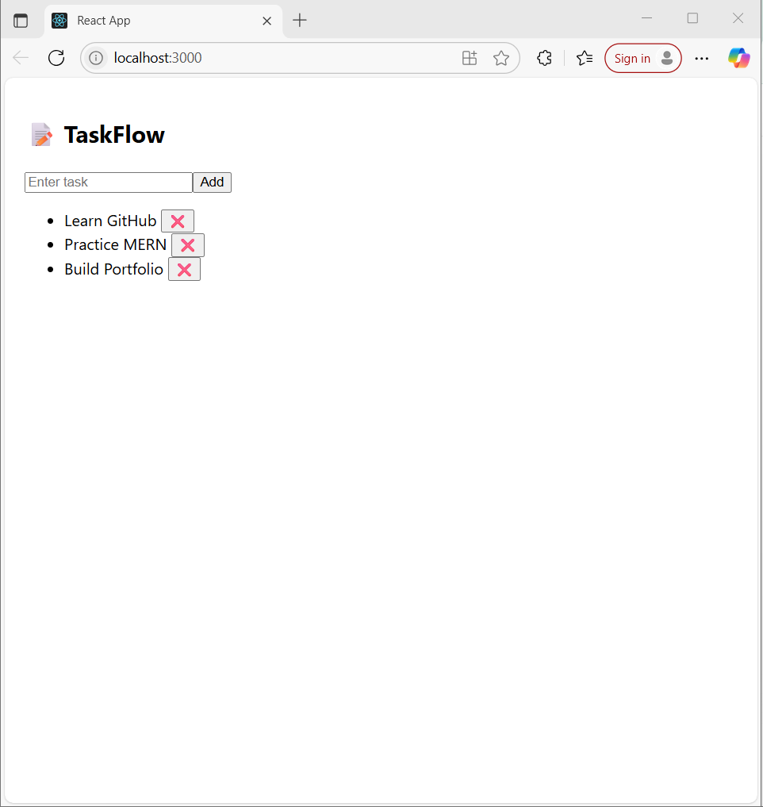

# 📝 TaskFlow – MERN Stack Task Manager



**TaskFlow** is a full-stack task management application built using the MERN stack (MongoDB, Express, React, Node.js).  
It allows users to add, view, and delete tasks in real time with a simple and responsive UI.

---

## 🔧 Features

- ➕ Add tasks
- 📋 View a list of tasks
- ❌ Delete tasks
- 🌐 REST API using Express + MongoDB
- 🎨 Minimal React frontend with live updates

---

## 🛠️ Technologies Used

**Frontend:** React, CSS  
**Backend:** Node.js, Express.js, MongoDB, Mongoose  
**Other:** CORS, Fetch API

---

## 🚀 How to Run Locally

### 1. Clone the repository
```bash
git clone https://github.com/your-username/TaskFlow.git
cd TaskFlow
```

### 2. Start the backend
```bash
cd server
npm install
node index.js
```

### 3. Start the frontend
Open a second terminal:
```bash
cd client
npm install
npm start
```

---

## 📂 Folder Structure

```
TaskFlow/
├── client/        # React frontend
├── server/        # Express backend + MongoDB
└── README.md
```

---

## 👨‍💻 Author

**Jami Bhargav Venkat**  
[GitHub: bhargavjami](https://github.com/bhargavjami)

---

> This project was created as part of my MERN stack learning and preparation for full-stack developer interviews.
